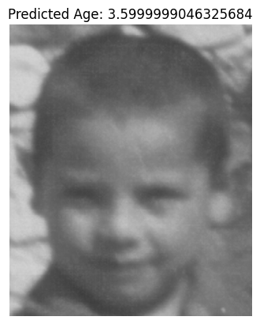

# Face Age Prediction & Cross-Age Face Matching

This project implements:

✅ **Age Prediction** using transfer learning (**ResNet50**)  
✅ **Cross-Age Face Matching** using **DeepFace (Facenet512)**  
✅ A full pipeline trained and tested on the **FG-NET Aging Dataset**.


## Project Structure

```

face-age-matching/
│
├── notebook/
│   └── face\_age\_matching.ipynb        # Main notebook (training + inference)
│
├── models/
│   └── age\_model\_resnet50.h5          # (Optional) Trained age prediction model
│
├── examples/                          # Visual results used in README
│   ├── example\_age\_prediction.png
│   ├── example\_face\_matching\_true.png
│   └── example\_face\_matching\_false.png
│
├── requirements.txt                    # Dependencies
└── README.md                           # Project description (this file)

````

---

## Setup Instructions

### 1️⃣ Clone the repository
```bash
git clone https://github.com/YOUR_USERNAME/face-age-matching.git
cd face-age-matching
````

### 2️⃣ Install dependencies

```bash
pip install -r requirements.txt
```

### 3️⃣ Download the dataset

The project uses the **[FG-NET Aging Dataset](https://www.kaggle.com/datasets/aiolapo/fgnet-dataset)**.
Make sure to place it under:

```
/content/fgnet-dataset/FGNET/images
```

---

## Training the Age Prediction Model

We trained the age prediction model using **Transfer Learning** with ResNet50:

* **Loss**: Mean Squared Error (MSE)
* **Metric**: Mean Absolute Error (MAE)
* **Data Augmentation**: Rotation, flips, brightness changes to reduce overfitting.

Training command (already inside the notebook):

```python
history = age_model.fit(
    train_gen,
    validation_data=val_gen,
    epochs=30
)
```

---

## Performance

### ✅ **Age Prediction**

* **Validation MAE**: \~4 years
* **Learning Curve**:
  

### ✅ **Face Matching**

* **Model**: Facenet512 (DeepFace)
* **Accuracy**: \~76%
* **ROC-AUC**: \~0.9
* **ROC Curve**:
  

---

## Inference Examples

### **Age Prediction Example**

Predicting the age of a single image:

```python
pred = predict_age("path_to_image.jpg")
print(f"Predicted Age: {pred}")
```


### **Face Matching Example**

Same person across different ages:

```python
full_inference(img1_path, img2_path)
```

✅ **Same Person Detected**


❌ **Different People**


---


